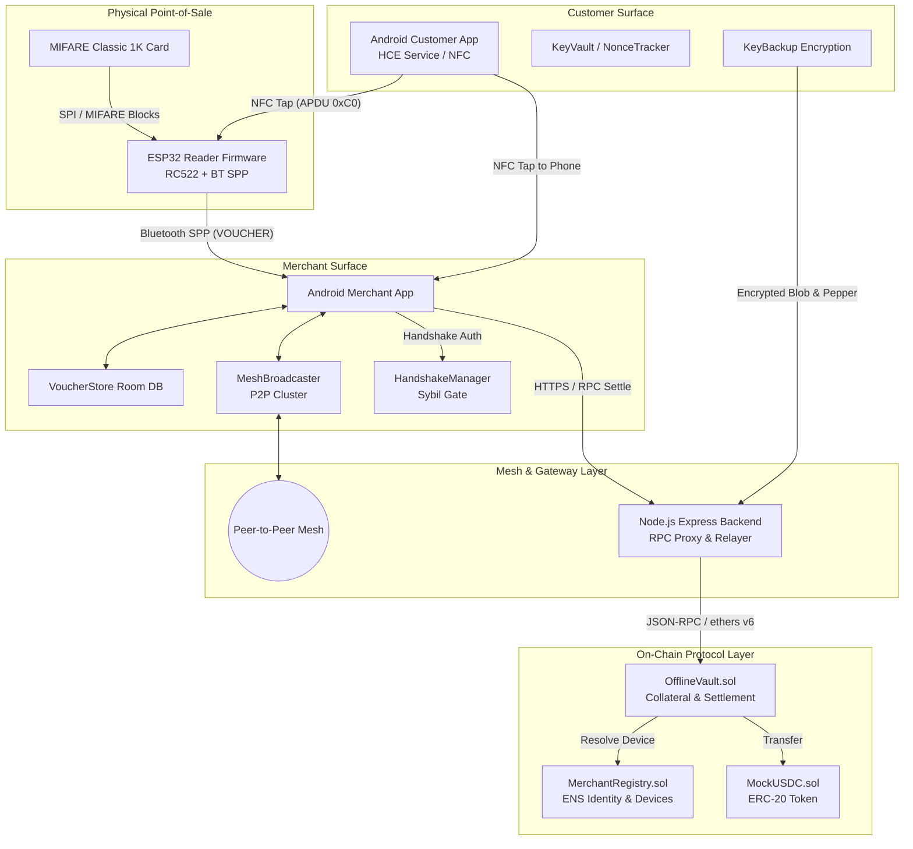
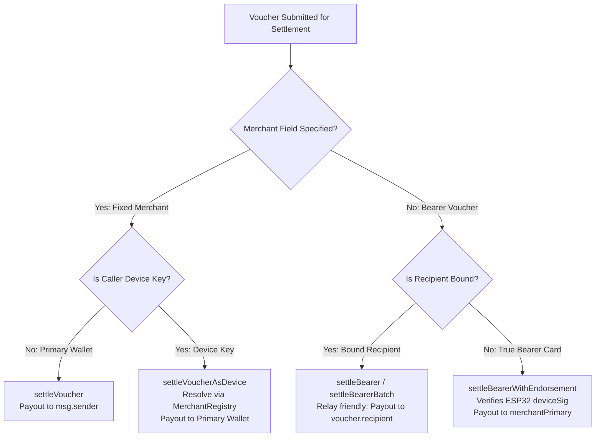
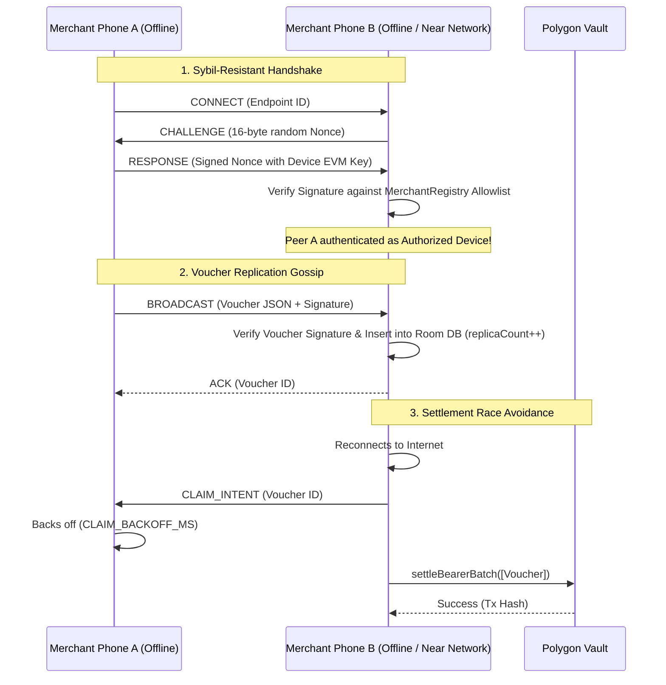
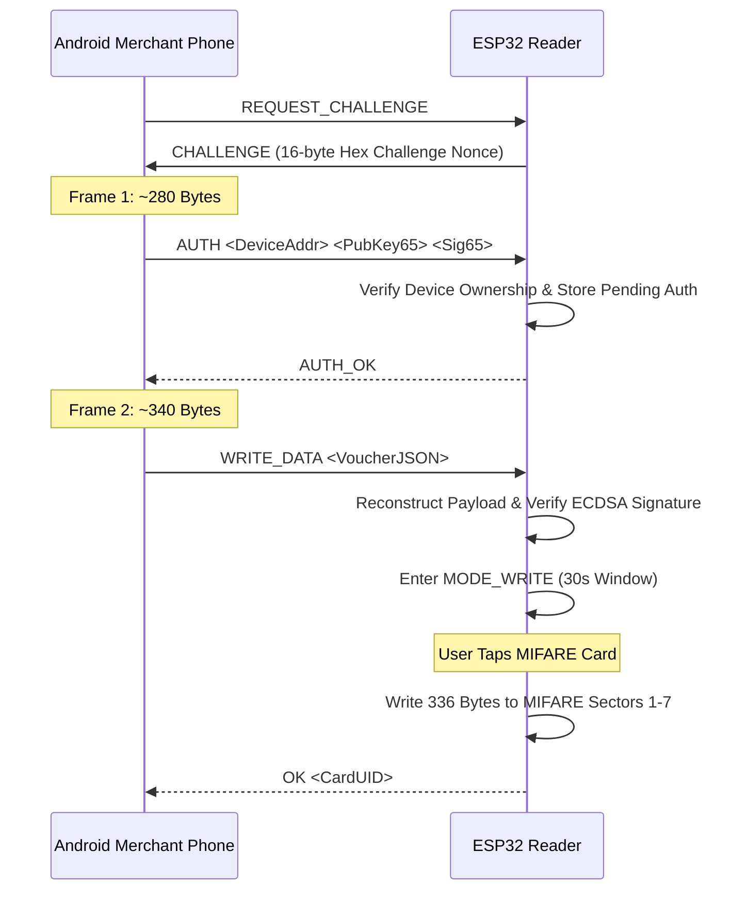
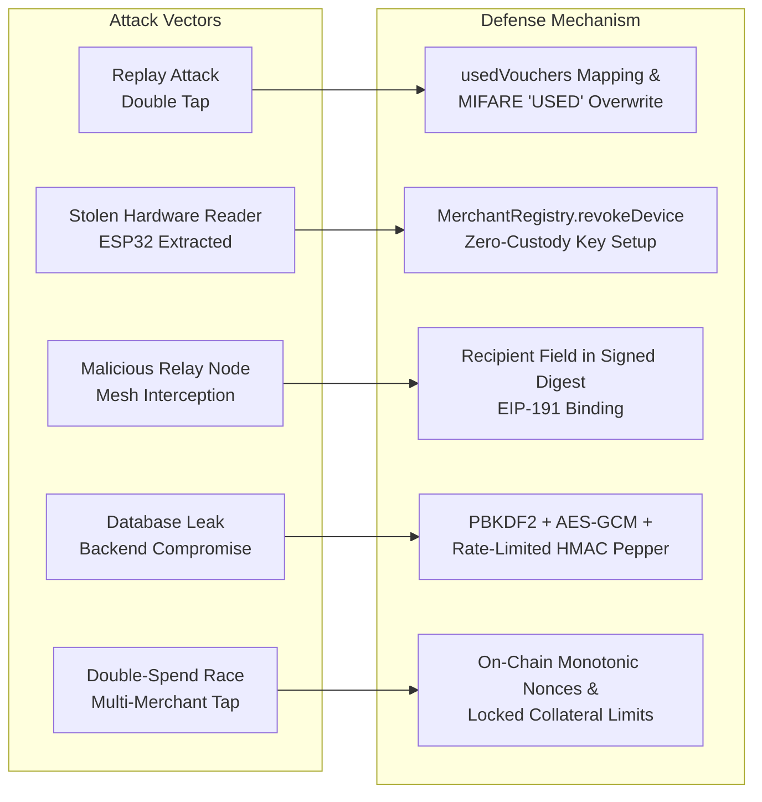
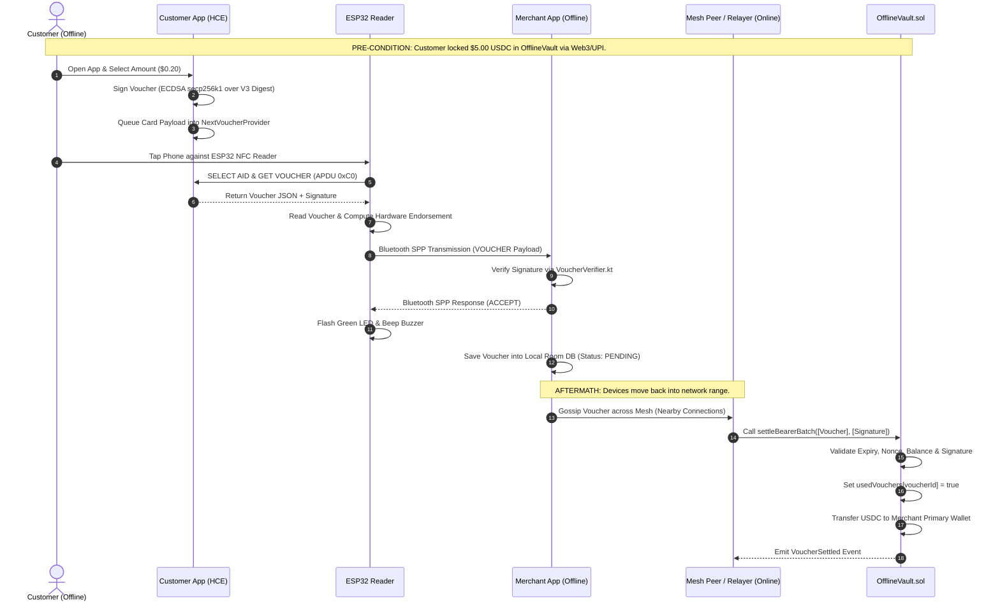

# OfflinePay — Complete System Architecture & Technical Specification

Welcome to the definitive architecture specification for **OfflinePay** — a decentralized, dual-offline cryptocurrency payment protocol designed for micro-transactions (e.g., transit, street vendors, rural commerce) on Ethereum-compatible blockchains (Polygon POS / Amoy Testnet).

---

## 1. Executive Summary & Core Value Proposition

In regions with intermittent internet connectivity or congested cellular networks, digital payment rails often fail at the point of sale. Existing off-chain payment solutions usually require at least one party (the merchant terminal or the customer phone) to have active internet access to communicate with a ledger or payment processor.

**OfflinePay** solves this fundamental bottleneck:

1. **Dual-Offline Operating Capability**: At tap time, **neither** the customer nor the merchant requires cellular or Wi-Fi data.
2. **Pre-Signed Vault Vouchers**: Customers lock USDC collateral into an on-chain smart contract ([`OfflineVault.sol`](file:///d:/offpay/contracts/contracts/OfflineVault.sol)) prior to going offline. Offline taps exchange cryptographically signed, off-chain payment vouchers.
3. **Local Validation**: Merchants use standalone hardware (ESP32 Bluetooth/NFC readers) or Android smartphones to perform zero-latency ECDSA public key recovery ($O(1)$ complexity) and EIP-191 digest verification locally.
4. **Resilient Settlement & Mesh Propagation**: Vouchers are stored in local SQLite databases on merchant devices. When any single peer in the local ecosystem reconnects to the network, vouchers settle on Polygon. Offline nodes propagate vouchers durability-first across peer-to-peer mesh networks (Android Nearby Connections).
5. **Zero-Custody Merchant Identity**: Hardware readers (ESP32) hold unique EVM device keys bound on-chain to the merchant’s primary wallet ([`MerchantRegistry.sol`](file:///d:/offpay/contracts/contracts/MerchantRegistry.sol)). If a physical hardware device is lost or stolen, revoking the device key instantly neutralizes threat vectors without endangering accumulated merchant funds.

---

## 2. High-Level System Architecture

The ecosystem comprises six primary technology stacks communicating across four distinct network layers:



---

## 3. Cryptographic Specification & Security Primitives

OfflinePay relies on standard secp256k1 elliptic curve cryptography, Keccak-256 hashing, and EIP-191 signatures across all platforms (Android Kotlin, ESP32 C++, Node.js JavaScript, and Solidity).

### 3.1 Canonical Voucher Digest ($V_3$)

To guarantee cross-platform deterministic signature generation and verification, the voucher digest calculation **must** remain 100% byte-identical across all components:

$$\text{VoucherDigest} = \text{Keccak-256}\Big(\text{abi.encode}\big( \text{payer}, \text{merchant}, \text{recipient}, \text{amount}, \text{expiry}, \text{nonce}, \text{voucherId}, \text{chainId}, \text{vaultAddress} \big)\Big)$$

Where:
- `payer` (*address*, 20 bytes): EVM address locking the collateral.
- `merchant` (*address*, 20 bytes): Target merchant address (`0x0000000000000000000000000000000000000000` for Bearer vouchers).
- `recipient` (*address*, 20 bytes): Address authorized to receive payouts (bound at signing time to prevent relay redirection).
- `amount` (*uint256*, 32 bytes): Transaction value in USDC base units ($1 \text{ USDC} = 10^6 \text{ units}$).
- `expiry` (*uint256*, 32 bytes): Unix epoch timestamp after which settlement reverts.
- `nonce` (*uint256*, 32 bytes): Strictly monotonic counter per payer (for fixed-merchant path).
- `voucherId` (*bytes32*, 32 bytes): Unique 256-bit identifier (UUIDv4 hashed or random bytes).
- `chainId` (*uint256*, 32 bytes): Network Chain ID (e.g., `80002` for Polygon Amoy).
- `vaultAddress` (*address*, 20 bytes): Address of the deployed [`OfflineVault`](file:///d:/offpay/contracts/contracts/OfflineVault.sol) contract.

### 3.2 EIP-191 Personal Sign Wrapping

Before signing or verifying, the raw 32-byte `VoucherDigest` is converted to an Ethereum Signed Message:

$$\text{EthSignedMessageHash} = \text{Keccak-256}\Big( \text{"\x19Ethereum Signed Message:\n32"} \;\parallel\; \text{VoucherDigest} \Big)$$

$$\text{Signature} = \text{ECDSA\_Sign}_{K_{\text{private}}}\big(\text{EthSignedMessageHash}\big) = \{ r, s, v \}$$

### 3.3 ESP32 Reader Hardware Endorsement Digest

For true bearer vouchers where the card top-up cannot know the target merchant in advance (`recipient == 0x0`), the ESP32 hardware reader appends a signed **endorsement** at tap time binding its EVM key and the merchant's primary wallet:

$$\text{EndorsementDigest} = \text{Keccak-256}\Big(\text{abi.encode}\big( \text{Keccak-256}("OFFPAY-ENDORSE-V1"), \text{voucherId}, \text{deviceAddress}, \text{merchantPrimary}, \text{endorsementTs}, \text{chainId}, \text{vaultAddress} \big)\Big)$$

### 3.4 Domain Separation & Challenge-Response Primitives

To prevent cross-protocol replay attacks when communicating over Bluetooth SPP, OfflinePay enforces domain-separated EIP-191 signatures:

| Operation | Domain Prefix Constant | Signed Message Payload Structure |
| :--- | :--- | :--- |
| **Claim Reader Ownership** | `OFFPAY-CLAIM-V1` | `Domain` $\parallel$ `ESP32_BT_MAC` (6B) $\parallel$ `ChallengeNonce` (16B) |
| **Write Card Authorization** | `OFFPAY-WRITE-V1` | `Domain` $\parallel$ `ESP32_BT_MAC` (6B) $\parallel$ `ChallengeNonce` (16B) $\parallel$ `Keccak256(JSON)` (32B) |
| **Hardware Endorsement** | `OFFPAY-ENDORSE-V1` | Implemented in [`endorsementDigest`](file:///d:/offpay/contracts/contracts/OfflineVault.sol#L253) |

---

## 4. Smart Contract Architecture (`contracts/`)

The contract layer consists of three Solidity contracts compiled via Hardhat (`pragma solidity ^0.8.24`):

```
contracts/contracts/
├── OfflineVault.sol      # Core collateral vault & multi-path settlement engine
├── MerchantRegistry.sol   # ENS-style identity & device authorization registry
└── MockUSDC.sol          # Mintable ERC-20 token simulating USDC (6 decimals)
```

### 4.1 [`OfflineVault.sol`](file:///d:/offpay/contracts/contracts/OfflineVault.sol)

`OfflineVault` manages customer balances, limits risk exposure, enforces single-use nonces/IDs, and handles settlements.

#### Parameter & Risk Controls
- `maxSinglePayment` (*uint256*): Hard ceiling per voucher (default: $2.00 = 2,000,000$ base units).
- `maxLockedBalance` (*uint256*): Maximum locked collateral per customer (default: $5.00 = 5,000,000$ base units).
- `defaultVoucherTTL` (*uint256*): Default voucher validity lifetime (default: 24 hours).

#### Core State Variables
- `mapping(address => uint256) public lockedBalance`: Collateral balance per payer.
- `mapping(address => uint256) public lastNonce`: Monotonic nonce tracker per customer wallet.
- `mapping(bytes32 => bool) public usedVouchers`: Anti-double-spend mapping indexed by `voucherId`.

#### Settlement Paths Matrix



### 4.2 [`MerchantRegistry.sol`](file:///d:/offpay/contracts/contracts/MerchantRegistry.sol)

Acts as an on-chain directory mapping string identifiers (e.g., `"chai-stall-mg-road"`) to primary settlement wallets and managing authorized device keys (smartphones, ESP32 readers).

#### Key Functions
- `register(string name)`: Registers a new merchant ID (`keccak256(bytes(name))`); sets `msg.sender` as primary wallet.
- `authorizeDevice(bytes32 id, address device)`: Authorizes a device key to sign/settle on behalf of `id`.
- `revokeDevice(bytes32 id, address device)`: Revokes device authorization immediately.
- `resolveDevice(address device)`: Returns `(bytes32 merchantId, address primaryWallet)` for device key resolution during `settleVoucherAsDevice`.

---

## 5. Android Customer Engine & NFC HCE Stack (`android-customer/`)

The customer application enables users to deposit collateral, sign vouchers locally, and present them via NFC Host Card Emulation (HCE) or QR codes.

```
android-customer/app/src/main/java/com/offlinepay/customer/
├── HceVoucherService.kt     # Android HostApduService (NFC responder)
├── NextVoucherProvider.kt   # In-memory thread-safe FIFO queue
├── VoucherSigner.kt         # ECDSA secp256k1 signing engine
├── NonceTracker.kt          # Synchronous persistent counter (commit-backed)
├── KeyVault.kt              # SharedPreferences key storage
├── KeyBackup.kt             # PBKDF2 + AES-GCM backup generator/restorer
└── BackupRestoreActivity.kt # UI for passphrase backup & server restore
```

### 5.1 Host Card Emulation APDU Protocol ([`HceVoucherService.kt`](file:///d:/offpay/android-customer/app/src/main/java/com/offlinepay/customer/HceVoucherService.kt))

When an NFC reader terminal scans the phone, the Android OS invokes `HceVoucherService.processCommandApdu()`:

1. **SELECT AID Command**:
   - Request: `[0x00, 0xA4, 0x04, 0x00, <len>, <AID bytes>, 0x00]`
   - Response: `0x9000` (SW_OK).
2. **GET VOUCHER Command**:
   - Request INS: `0xC0` (`[0x00, 0xC0, 0x00, 0x00]`)
   - Processing: Peeks and consumes the next pre-signed JSON voucher string from [`NextVoucherProvider`](file:///d:/offpay/android-customer/app/src/main/java/com/offlinepay/customer/HceVoucherService.kt#L52).
   - Response Frame:
     $$\text{Response} = \big[ \text{Length}_{\text{MSB}}, \text{Length}_{\text{LSB}} \big] \;\parallel\; \text{PayloadBytes} \;\parallel\; \big[ 0\text{x}90, 0\text{x}00 \big]$$

### 5.2 Nonce Integrity & Monotonicity ([`NonceTracker.kt`](file:///d:/offpay/android-customer/app/src/main/java/com/offlinepay/customer/NonceTracker.kt))

- Nonces increment strictly per customer wallet.
- `NonceTracker.next()` writes updates to storage via **synchronous `.commit()`** (never asynchronous `.apply()`). This ensures that even during a sudden crash or battery pull, nonces are never reused.
- **Account Recovery Offset**: Upon key restoration on a new phone, `RECOVERY_SKIP = 1000` is automatically added to the last on-chain nonce (`nextNonce = onChainLastNonce + 1000`) to prevent nonce collisions with pending in-flight offline vouchers.

### 5.3 Encrypted Key Backup Architecture ([`KeyBackup.kt`](file:///d:/offpay/android-customer/app/src/main/java/com/offlinepay/customer/KeyBackup.kt))

To enable safe seedless recovery without giving the backend access to private keys:

```
Passphrase + ServerPepper (HMAC)
            │
            ▼
PBKDF2-HMAC-SHA256 (200,000 Iterations, 16B Salt)
            │
            ▼
    256-bit AES Key
            │
            ▼
AES-GCM Encryption (12B IV) ──► Encrypted Payload { privateKeyHex, lastNonce }
```

- Server-side pepper endpoint (`GET /api/keybackup/pepper/:userId`) computes:
  $$\text{Pepper} = \text{HMAC-SHA256}\big(\text{KEYBACKUP\_PEPPER\_SECRET}, \text{userId}\big)$$
- Rate limited strictly to **5 requests per 15 minutes** per `(IP, userId)` to prevent user enumeration and offline dictionary attacks.

---

## 6. Android Merchant Engine & P2P Mesh Gossip (`android-merchant/`)

The merchant application processes incoming taps, verifies cryptographic proofs locally, records transactions in a local database, and gossips transactions across a mesh network.

```
android-merchant/app/src/main/java/com/offlinepay/merchant/
├── MainActivity.kt        # UI wiring & lifecycle management
├── BluetoothBridge.kt     # Bluetooth SPP framing & ESP32 communication
├── VoucherVerifier.kt     # Web3j local ECDSA recovery & EIP-191 verification
├── VoucherStore.kt        # Room Database manager & durability tracker
├── MeshBroadcaster.kt     # Nearby Connections P2P_CLUSTER gossip engine
├── HandshakeManager.kt    # Sybil-resistant peer authentication gate
├── MerchantKeyVault.kt    # Local EVM key storage
└── SettlementClient.kt    # HTTP client for on-chain settlement via backend/RPC
```

### 6.1 Local ECDSA Verification Engine ([`VoucherVerifier.kt`](file:///d:/offpay/android-merchant/app/src/main/java/com/offlinepay/merchant/VoucherVerifier.kt))

Verification executes off-line in $< 5 \text{ milliseconds}$:

```kotlin
fun verify(v: Voucher): VerifyResult {
    if (currentTime() > v.expiry) return EXPIRED
    if (v.amount > maxSinglePayment) return EXCEEDS_LIMIT
    if (voucherStore.exists(v.voucherId)) return ALREADY_SEEN
    
    val digest = voucherDigest(v)
    val ethSignedHash = ethSignedMessageHash(digest)
    val recoveredAddress = recoverAddress(ethSignedHash, v.signature)
    
    return if (recoveredAddress.equalsIgnoreCase(v.payer)) VALID else BAD_SIGNATURE
}
```

### 6.2 Peer-to-Peer Mesh Engine (`MeshBroadcaster` & `HandshakeManager`)

Merchant phones form an ad-hoc local mesh network using Google Nearby Connections (`P2P_CLUSTER` strategy).



1. **Replication Guarantee**: Vouchers replicate to surrounding peers to prevent data loss if a device is physically damaged before connecting to the internet.
2. **Sybil Resistance**: Unverified peer endpoints are forbidden from submitting vouchers or influencing `replicaCount`. Peer identities must be authenticated via challenge-response signed by a registered device key.
3. **Settlement Race Avoidance (`claimAndWait`)**: When network connection is restored, peers emit a `CLAIM_INTENT`. If two nodes attempt to settle the same voucher simultaneously, deterministic backoff logic delays execution, avoiding redundant transaction gas fees.

---

## 7. ESP32 Firmware Reader & Hardware Wallet (`firmware/reader/`)

The hardware reader provides a low-cost, dedicated point-of-sale terminal built on the ESP32 microcontroller and an RC522 RFID reader.

```
firmware/reader/
├── offline_pay_reader.ino # Main Arduino loop, BT SPP parser & MIFARE handler
├── wallet.h               # Keygen & crypto header
└── wallet.cpp             # Standalone Keccak-256 & mbedtls secp256k1 engine
```

### 7.1 ESP32 Microcontroller Specifications & Hardware Pinout

| ESP32 GPIO Pin | Connected Peripheral Function |
| :--- | :--- |
| **GPIO 5** | RC522 SPI SS (SDA) |
| **GPIO 18** | RC522 SPI SCK |
| **GPIO 19** | RC522 SPI MISO |
| **GPIO 23** | RC522 SPI MOSI |
| **GPIO 22** | RC522 Hardware Reset (RST) |
| **GPIO 26** | Green Status LED (220 $\Omega$ to GND) |
| **GPIO 27** | Red Status LED (220 $\Omega$ to GND) |
| **GPIO 25** | Piezoelectric Buzzer (+) |

### 7.2 MIFARE Classic 1K Card Memory Mapping

Vouchers write across **21 data blocks** (Sectors 1 through 7, excluding Sector Trailers `7, 11, 15, 19, 23, 27, 31`):

$$\text{Total Storage Capacity} = 21 \text{ blocks} \times 16 \text{ bytes/block} = 336 \text{ bytes}$$

```
Sector 0: [ Block 0: Manufacturer Data ] [ Blocks 1-2: Reserved ] [ Block 3: Trailer ]
Sector 1: [ Block 4: JSON Data ] [ Block 5: JSON Data ] [ Block 6: JSON Data ] [ Block 7: Trailer ]
...
Sector 7: [ Block 28: JSON Data ] [ Block 29: JSON Data ] [ Block 30: JSON Data ] [ Block 31: Trailer ]
```

When a voucher is successfully accepted by the merchant app, the ESP32 overwrites all 21 data blocks with the literal ASCII sentinel `USED____________` to prevent offline physical card replays.

### 7.3 Two-Step Bluetooth SPP Buffer Overflow Avoidance Protocol

The standard ESP32 Bluetooth Serial (SPP) receive ring buffer is capped at 512 bytes. Transmitting a complete card write command (containing an address, public key, signature, and JSON payload) requires ~620 bytes, triggering buffer truncation.

OfflinePay solves this with a two-step handshake:



### 7.4 Cryptographic Hash Implementation: Keccak-256 vs NIST SHA3-256

> [!WARNING]
> Standard `mbedtls_sha3_*` library functions emit **NIST SHA3-256**, which uses different padding bytes (`0x06`) than Ethereum’s **Keccak-256** (`0x01`). Replacing the custom implementation in [`wallet.cpp`](file:///d:/offpay/firmware/reader/wallet.cpp) with standard Mbed TLS SHA3 will break on-chain signature verification.

The ESP32 firmware includes a custom Keccak-256 implementation:
```cpp
void keccak256_arduino(const uint8_t *input, size_t len, uint8_t *output) {
    // Custom Keccak-f[1600] permutation with Ethereum padding (0x01 ... 0x80)
}
```

---

## 8. Relay Backend & Infrastructure (`backend/`)

The backend is built with Node.js 18+ ESM, Express, `better-sqlite3`, and `ethers.js` v6.

```
backend/
├── src/
│   ├── server.js    # All REST routes & RPC proxy
│   ├── chain.js     # Ethers.js provider, signer, & vault bindings
│   ├── voucher.js   # Node.js canonical voucher digest & signing utilities
│   ├── db.js        # SQLite DDL schema & database initialization
│   └── config.js    # Environment configuration
└── data/            # Runtime sqlite database file (gitignored)
```

### 8.1 API Endpoint Reference

#### RPC Proxy Component
- `POST /rpc`: Transparently proxies JSON-RPC calls to the upstream Polygon RPC node. Mobile devices connect via ADB reverse port forwarding (`adb reverse tcp:4000 tcp:4000`), allowing offline-configured phones to reach the chain through the developer's laptop over USB.

#### Wallet & On-Ramp Endpoints
- `POST /api/topup`: Simulates INR $\rightarrow$ USDC conversion via UPI. Mints MockUSDC, approves `OfflineVault`, executes `lockFunds()`, and issues pre-signed bearer vouchers.
- `POST /api/wallet/topup`: Atomic top-up execution wrapped in `withChainLock()` mutex queue.
- `POST /api/wallet/init`: Self-custody wallet preparation. Automatically gas-funds new mobile wallets with MATIC if balance $< 0.02 \text{ MATIC}$ and mints testnet USDC.
- `POST /api/faucet`: Rate-limited testnet MATIC and MockUSDC faucet.

#### Settlement & Relay Endpoints
- `POST /api/wallet/redeem`: Relay settlement endpoint. Accepts array of vouchers `[{ voucher, signature }]`, pre-validates signatures off-chain, and executes `OfflineVault.settleBearerBatch()` on-chain.
- `POST /api/merchant/redeem`: Receives vouchers harvested from offline merchant taps and stores them as `redeemed` in SQLite.
- `POST /api/merchant/settle`: Fetches pending `redeemed` vouchers from SQLite and submits `settleBatch()` on-chain.

#### Key Backup & Security Endpoints
- `POST /api/keybackup`: Stores encrypted customer key blobs (AES-GCM ciphertext).
- `GET /api/keybackup/:userId`: Retrieves encrypted key blob for account recovery.
- `GET /api/keybackup/pepper/:userId`: Generates and returns a user-specific pepper derived via server HMAC. Rate-limited to 5 requests per 15 mins.

---

## 9. Unified Wallet, Dashboard, & Simulator Tooling

### 9.1 Judge Console & Dashboard (`dashboard/`)
A single-page web app built with HTML5, Tailwind CSS, and vanilla JavaScript. Connects to `GET /api/stats` to render real-time payment statistics, issued voucher volume, settlement statuses, and interactive flow triggers.

### 9.2 Local Network Simulator (`simulator/`)
Node.js test scripts designed to simulate multi-device environments:
- Simulates $N$ parallel customer taps against $M$ merchant devices.
- Tests mesh gossip propagation and settlement race handling under simulated latency and packet drop rates.

---

## 10. Information Architecture & Exhaustive Data Schemas

### 10.1 Wire Voucher JSON Schema (NFC & Bluetooth Payload)

To minimize payload size for low-frequency NFC and Bluetooth transmission, JSON key strings are compacted:

```json
{
  "v": 3,
  "p": "0x70997970c51812dc3a010c7d01b50e0d17dc79c8",
  "m": "0x0000000000000000000000000000000000000000",
  "r": "0x3c44cdedd8a9e44f0153b01409729804193097b1",
  "a": "200000",
  "e": 1724799999,
  "n": 42,
  "i": "0xa1b2c3d4e5f67890123456789abcdef0123456789abcdef0123456789abcdef0",
  "s": "0x3a4b...65byteHexSig"
}
```

#### Field Description & Type Mapping
| Wire Key | Full Attribute Name | Data Type | Description |
| :--- | :--- | :--- | :--- |
| `v` | `version` | *Integer* | Protocol schema version (default: `3`). |
| `p` | `payer` | *String (Hex Address)* | EVM address of customer locking collateral. |
| `m` | `merchant` | *String (Hex Address)* | Target merchant address (`0x0` = bearer flow). |
| `r` | `recipient` | *String (Hex Address)* | EVM address authorized to receive USDC payout. |
| `a` | `amount` | *String (Decimal)* | Amount in USDC base units ($200000 = \$0.20$). |
| `e` | `expiry` | *Integer (Unix Seconds)* | Expiry timestamp. |
| `n` | `nonce` | *Integer* | Customer monotonic nonce. |
| `i` | `voucherId` | *String (0x Hex)* | Unique 32-byte identifier. |
| `s` | `signature` | *String (0x Hex)* | 65-byte EIP-191 ECDSA signature ($r \parallel s \parallel v$). |

---

### 10.2 Database Schemas

#### Backend Relayer SQLite Schema ([`db.js`](file:///d:/offpay/backend/src/db.js))

```sql
CREATE TABLE IF NOT EXISTS customers (
    address TEXT PRIMARY KEY,
    upi_id TEXT,
    created_at INTEGER NOT NULL
);

CREATE TABLE IF NOT EXISTS topups (
    id TEXT PRIMARY KEY,
    customer TEXT NOT NULL,
    upi_ref TEXT UNIQUE NOT NULL,
    amount_inr_paise INTEGER NOT NULL,
    amount_usdc TEXT NOT NULL,
    status TEXT NOT NULL,
    created_at INTEGER NOT NULL
);

CREATE TABLE IF NOT EXISTS vouchers (
    voucher_id TEXT PRIMARY KEY,
    payer TEXT NOT NULL,
    merchant TEXT NOT NULL,
    recipient TEXT,
    amount TEXT NOT NULL,
    expiry INTEGER NOT NULL,
    nonce INTEGER NOT NULL,
    signature TEXT NOT NULL,
    status TEXT NOT NULL, -- 'issued', 'redeemed', 'settled'
    issued_at INTEGER NOT NULL,
    redeemed_at INTEGER,
    settled_tx TEXT
);

CREATE TABLE IF NOT EXISTS keybackups (
    user_id TEXT PRIMARY KEY,
    address TEXT NOT NULL,
    salt_b64 TEXT NOT NULL,
    iv_b64 TEXT NOT NULL,
    ciphertext_b64 TEXT NOT NULL,
    iterations INTEGER NOT NULL,
    updated_at INTEGER NOT NULL
);
```

#### Android Merchant Room Database Schema ([`VoucherStore.kt`](file:///d:/offpay/android-merchant/app/src/main/java/com/offlinepay/merchant/VoucherStore.kt))

```sql
CREATE TABLE IF NOT EXISTS vouchers (
    voucherId TEXT PRIMARY KEY NOT NULL,
    payer TEXT NOT NULL,
    merchant TEXT NOT NULL,
    recipient TEXT NOT NULL,
    amount INTEGER NOT NULL,
    expiry INTEGER NOT NULL,
    nonce INTEGER NOT NULL,
    signature TEXT NOT NULL,
    status TEXT NOT NULL, -- 'PENDING', 'SETTLED', 'FAILED'
    receivedAt INTEGER NOT NULL,
    replicaCount INTEGER NOT NULL DEFAULT 1,
    replicaPeers TEXT NOT NULL DEFAULT ''
);
```

---

## 11. Security Threat Model, Attacks & Defense Matrix



| Attack Scenario | Threat Mechanism | Protocol Defense & Risk Mitigation Strategy |
| :--- | :--- | :--- |
| **Physical Card Double-Tap** | Customer taps the same physical card twice at different offline merchant terminals. | **Hardware Level**: ESP32 overwrites card data blocks with `USED____________` immediately on accept.<br/>**Contract Level**: `OfflineVault` enforces single-use checking on `usedVouchers[voucherId]`. The second settlement reverts. |
| **Stolen ESP32 Terminal** | Physical device stolen from merchant store to extract private key from NVS flash memory. | **Zero-Custody Architecture**: ESP32 stores a *device key*, not a wallet holding funds. Merchant calls `MerchantRegistry.revokeDevice(esp32Address)`. The key is instantly rendered useless; funds remain safe in the merchant's primary wallet. |
| **Malicious Mesh Relay Interception** | A rogue peer intercepts an offline voucher during mesh propagation and attempts to redirect funds to its own wallet. | **Digest Recipient Binding**: $V_3$ binds the `recipient` address inside the signed EIP-191 digest. Modifying the payout address invalidates the customer's signature. |
| **Server Database Leak** | Attacker dumps backend SQLite database containing customer key backup blobs. | **Zero-Plaintext Storage**: Private keys are encrypted client-side using PBKDF2 (200,000 iterations) + AES-GCM. The key derivation requires a secret server pepper that is stored separately and accessible only via rate-limited API endpoints. |
| **Offline Double-Spending** | Customer signs multiple vouchers exceeding their total deposited collateral while remaining offline. | **Vault Cap Boundary**: Maximum locked balance per user is hard-capped on-chain ($5.00). Total merchant financial exposure is strictly bounded to the vault cap. |
| **Nonce Collision on Phone Recovery** | Customer restores their wallet on a new phone while pending offline vouchers exist on merchant terminals. | **Recovery Skip Offset**: Restored wallets resume nonce generation at `lastOnChainNonce + RECOVERY_SKIP` ($+1000$), ensuring old in-flight vouchers settle cleanly without blocking new ones. |

---

## 12. Operational End-to-End Walkthroughs

### 12.1 End-to-End Dual-Offline Payment Sequence



---

## Summary of Reference Files

| Component Layer | Primary Reference Files |
| :--- | :--- |
| **Smart Contracts** | [`OfflineVault.sol`](file:///d:/offpay/contracts/contracts/OfflineVault.sol), [`MerchantRegistry.sol`](file:///d:/offpay/contracts/contracts/MerchantRegistry.sol) |
| **Android Customer** | [`HceVoucherService.kt`](file:///d:/offpay/android-customer/app/src/main/java/com/offlinepay/customer/HceVoucherService.kt), [`VoucherSigner.kt`](file:///d:/offpay/android-customer/app/src/main/java/com/offlinepay/customer/VoucherSigner.kt), [`NonceTracker.kt`](file:///d:/offpay/android-customer/app/src/main/java/com/offlinepay/customer/NonceTracker.kt), [`KeyBackup.kt`](file:///d:/offpay/android-customer/app/src/main/java/com/offlinepay/customer/KeyBackup.kt) |
| **Android Merchant** | [`VoucherVerifier.kt`](file:///d:/offpay/android-merchant/app/src/main/java/com/offlinepay/merchant/VoucherVerifier.kt), [`MeshBroadcaster.kt`](file:///d:/offpay/android-merchant/app/src/main/java/com/offlinepay/merchant/MeshBroadcaster.kt), [`HandshakeManager.kt`](file:///d:/offpay/android-merchant/app/src/main/java/com/offlinepay/merchant/HandshakeManager.kt), [`VoucherStore.kt`](file:///d:/offpay/android-merchant/app/src/main/java/com/offlinepay/merchant/VoucherStore.kt) |
| **ESP32 Firmware** | [`offline_pay_reader.ino`](file:///d:/offpay/firmware/reader/offline_pay_reader.ino), [`wallet.h`](file:///d:/offpay/firmware/reader/wallet.h), [`wallet.cpp`](file:///d:/offpay/firmware/reader/wallet.cpp) |
| **Backend & Relay** | [`server.js`](file:///d:/offpay/backend/src/server.js), [`voucher.js`](file:///d:/offpay/backend/src/voucher.js), [`db.js`](file:///d:/offpay/backend/src/db.js) |
| **Repo Guide** | [`CLAUDE.md`](file:///d:/offpay/CLAUDE.md), [`README.md`](file:///d:/offpay/README.md) |
